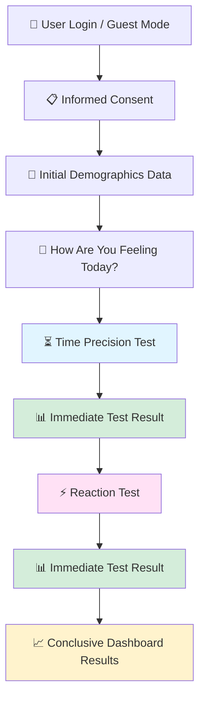

<div align="center">

# ADHDecode

### *Intelligent Adult ADHD Likelihood Screening Platform*

[]()
[]()
[]()

---

**ADHDecode** is a behavioral + questionnaire-based web application designed to estimate the likelihood of ADHD traits in adults using structured self-report measures and real-time cognitive micro-tasks.

*It combines psychometric screening with measurable behavioral signals to generate a structured, explainable likelihood score.*

</div>
---

👥 Team

<b>Aryama Ray</b><br>
https://www.linkedin.com/in/aryamaray/

<b>Debisree Ray</b><br>
https://www.linkedin.com/in/debisree-ray-ph-d-82241355/


</div>
---

## ⚠️ **Important Notice**

> **ADHDecode is a screening and awareness tool.**  
> It is **not a medical diagnosis** and does not replace professional clinical evaluation.

---

## 🌍 **Vision**

ADHDecode aims to bridge the gap between:

<table>
<tr>
<td align="center">📝<br><b>Subjective symptom reporting</b></td>
<td align="center">📊<br><b>Objective behavioral measurement</b></td>
<td align="center">🎯<br><b>Accessible early awareness tools</b></td>
</tr>
</table>

By integrating cognitive testing with structured scoring, **ADHDecode moves beyond questionnaire-only screening**.

---

## 🏗 **Product Flow**



---

## 🔐 **Authentication**

<details>
<summary><b>Click to expand authentication options</b></summary>

Users may:

- ✅ **Create an account** (for longitudinal tracking)
- ✅ **Continue in Guest Mode** (session-based only)

> 💡 Guest data is not persistently stored.

</details>

---

## 📜 **Informed Consent**

Users must:

| Requirement | Description |
|------------|-------------|
| ✔️ **Age Verification** | Confirm age ≥ 18 |
| ✔️ **Acknowledgment** | Acknowledge non-diagnostic nature |
| ✔️ **Data Terms** | Accept data transparency terms |

---

## 👤 **Demographics & Context Collection**

Minimal contextual variables are collected to improve interpretability:

<table>
<tr>
<td>

📅 **Age group**  
👥 **Gender** *(optional)*  
🎓 **Education level**  
💼 **Employment status**

</td>
<td>

🏥 **Prior ADHD diagnosis** *(Yes/No/Unsure)*  
😴 **Sleep quality**  
☕ **Caffeine intake**  
💊 **Current medication** *(optional)*

</td>
</tr>
</table>

> These variables inform contextual adjustment but **do not determine outcome**.

---

## 🧪 **Screening Modules**

### 1️⃣ Symptom Screening

Choose from **three selectable modes**:

| Mode | Description | Coverage |
|------|-------------|----------|
| 🔹 **Quick Check** | Fast screening covering core ADHD domains | Basic |
| 🔸 **Moderate Check** | Expanded coverage: Inattention, Hyperactivity, Impulsivity, Executive function | Intermediate |
| 🔶 **Detailed Check** | Comprehensive screening aligned conceptually with DSM-5 criteria (screening-level only) | Comprehensive |

#### 📊 Scoring Method

```
✓ Likert-scale responses
✓ Domain-level subscales
✓ Weighted composite score
```

---

## 🧠 **Behavioral Cognitive Modules**

### ⏳ Time Perception Challenge

<table>
<tr>
<td width="50%">

**🎯 Purpose**

Measures internal time estimation accuracy and variability.

**📝 Task Structure**

- User produces target intervals (e.g., 3s, 6s, 10s, 15s)
- Multiple repeated trials

</td>
<td width="50%">

**📊 Captured Metrics**

**Per trial:**
- Target duration
- Produced duration
- Absolute error
- Signed bias

**Aggregate:**
- Mean absolute error
- Variability (SD)
- Performance drift

</td>
</tr>
</table>

> 💡 **Higher variability may indicate attention instability.**

---

### ⚡ Reaction Time Test

<table>
<tr>
<td width="50%">

**🎯 Purpose**

Measures response speed, attention stability, and impulsivity patterns.

**📝 Task Structure**

- Random delay (1–4s)
- Visual stimulus
- User responds as quickly as possible

</td>
<td width="50%">

**📊 Captured Metrics**

**Per trial:**
- Reaction time (ms)
- Premature response
- Missed response

**Aggregate:**
- Median reaction time
- Reaction time variability
- Error rate
- Percentile dispersion

</td>
</tr>
</table>

> 💡 **Reaction time variability is often more informative than raw speed.**

---

## 🧮 **Scoring Engine**

The final **ADHD Likelihood Score** integrates multi-dimensional inputs.

### ⚖️ Weighted Framework

| Component | Weight |
|-----------|--------|
| 📋 **Symptom Screening** | 50–60% |
| ⚡ **Reaction Time Variability & Errors** | 20–25% |
| ⏳ **Time Perception Variability** | 15–20% |
| 🔄 **Contextual Adjustment** | Dynamic |

### 🔢 Scoring Logic (Conceptual)

```
1. Normalize each component to 0–100 scale
2. Apply weighted aggregation
3. Adjust for contextual modifiers
4. Generate:
   ├── Overall likelihood score
   ├── Subscale breakdown
   └── Behavioral summary
```

### 📄 Output Report

Users receive:

- **📊 ADHD Likelihood Score** (0–100)
- **🎚️ Tier classification:**
  - 🟢 Low
  - 🟡 Mild
  - 🟠 Moderate
  - 🔴 High
- **📈 Domain-level breakdown**
- **🧠 Behavioral variability summary**
- **⚠️ Clear disclaimer**

---

## 🏛 **Technical Architecture**

### System Overview

```
┌─────────────────────────────┐
│  Frontend (HTML/CSS/JS)     │
└──────────────┬──────────────┘
               │
               ▼
┌─────────────────────────────┐
│  API Layer (Node.js/Python) │
└──────────────┬──────────────┘
               │
               ▼
┌─────────────────────────────┐
│     Scoring Engine          │
└──────────────┬──────────────┘
               │
               ▼
┌─────────────────────────────┐
│  Database (optional)        │
└──────────────┬──────────────┘
               │
               ▼
┌─────────────────────────────┐
│    Report Generator         │
└─────────────────────────────┘
```

### 🔧 Core Components

<table>
<tr>
<td width="33%">

**🎨 Frontend**

- Task rendering
- Real-time timers
- Stimulus control
- Trial-level logging

</td>
<td width="33%">

**⚙️ Backend**

- Session management
- Data validation
- Scoring computation
- Report generation

</td>
<td width="33%">

**💾 Data Layer**

- Encrypted user IDs
- Session logs
- Behavioral metrics
- Questionnaire responses

</td>
</tr>
</table>

---

## 🔬 **Research & Scientific Positioning**

ADHDecode draws conceptual inspiration from:

- 📋 **Adult ADHD Self-Report Scale (ASRS)**
- ⚡ **Reaction time variability research**
- 🚫 **Go/No-Go paradigms**
- ⏱️ **Time perception research in ADHD populations**

> ⚠️ This platform is **not affiliated** with clinical diagnostic instruments.

---

## 🔒 **Privacy & Ethics**

<div align="center">

| Principle | Commitment |
|-----------|------------|
| 🚫 | **No sale or sharing of data** |
| 🔐 | **Minimal personal identifiers** |
| 📖 | **Transparent data handling** |
| 🗑️ | **User deletion option** (account mode) |

**ADHDecode prioritizes ethical behavioral data usage.**

</div>

---

## 🚀 **Future Roadmap**

- [ ] 🚫 Go/No-Go inhibition module
- [ ] 🧩 Working memory task
- [ ] 👁️ Sustained Attention (CPT-style)
- [ ] 📊 Longitudinal tracking dashboard
- [ ] 🤖 AI-powered interpretability
- [ ] 🔬 Research validation study

---

## 🎯 **Intended Use**

<div align="center">

ADHDecode is designed for:

| Use Case |
|----------|
| 🧑‍💼 Adult awareness screening |
| 🔬 Research prototypes |
| 💡 Digital health innovation |
| 🎯 Early-stage cognitive assessment exploration |

</div>

---

## ⚠️ **Medical Disclaimer**

<div align="center">

### ⚕️ **IMPORTANT**

**ADHDecode does not diagnose ADHD.**

Results indicate **statistical likelihood patterns only**.

Users should consult **licensed professionals** for formal evaluation.

</div>

---

## 🛠 **Tech Stack**

<div align="center">


- ✅ Replit Deployment
- ✅ HTML / CSS / JavaScript
- ✅ Node.js or Python Backend
- ✅ Secure session handling
- ✅ Optional database integration

</div>

---

## 📄 **License & Copyright**

<div align="center">

**© 2026 ADHDecode. All rights reserved.**

---

*This software, design, scoring methodology, interface, and documentation are the intellectual property of ADHDecode.*

**Unauthorized reproduction, redistribution, or commercial use without written permission is strictly prohibited.**

---


</div>
